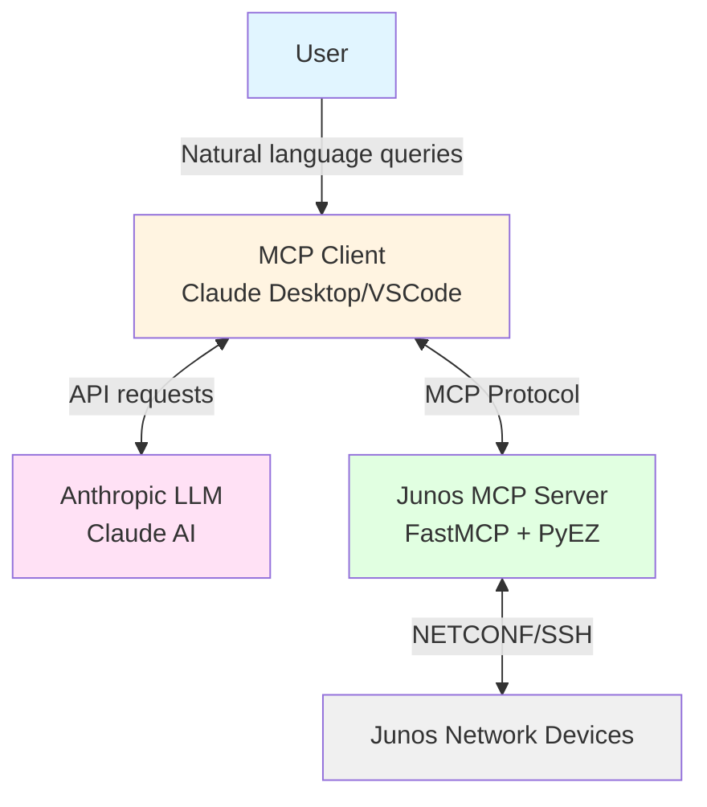
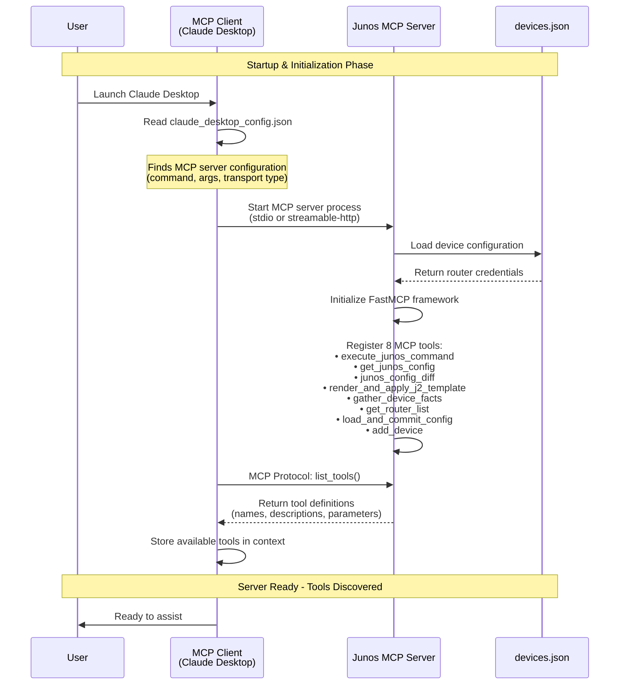
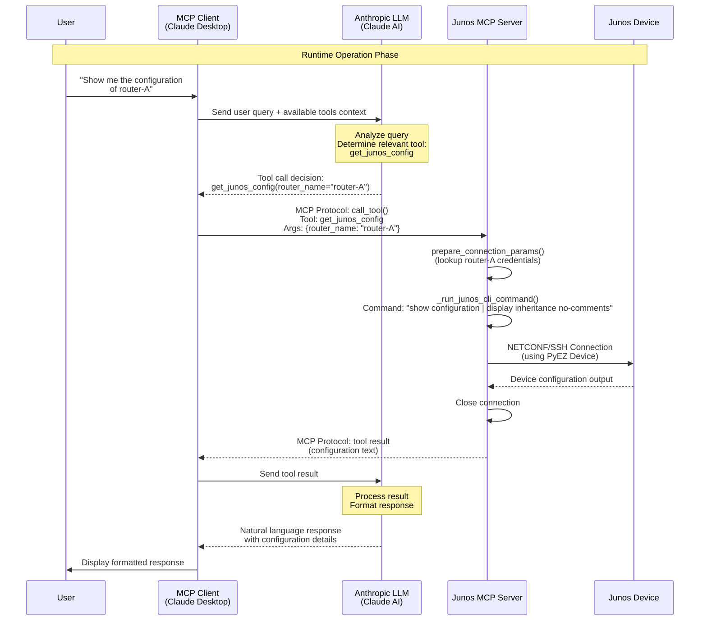
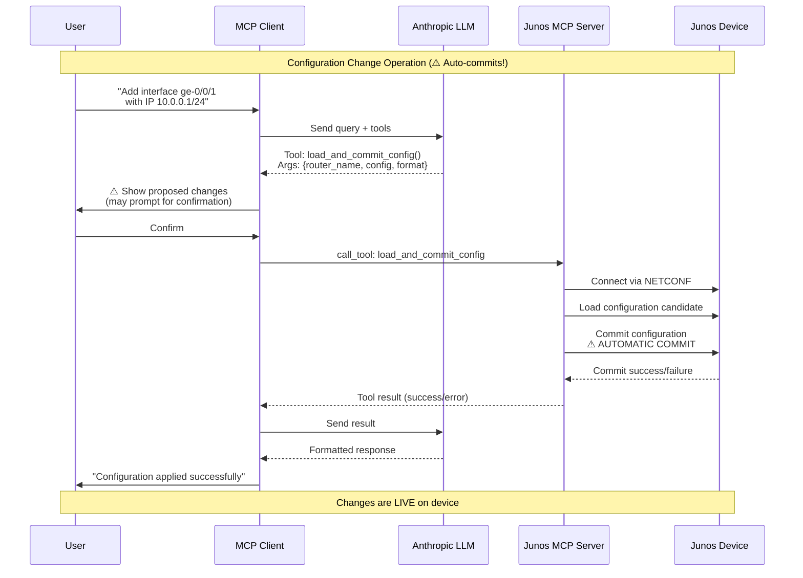
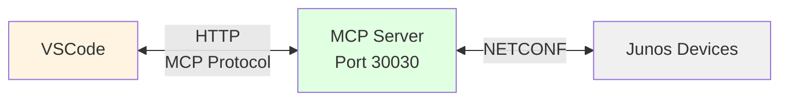

# MCP Flow Diagram - Junos MCP Server

## Overview

This document illustrates the Model Context Protocol (MCP) architecture and the interaction flow between the user, MCP client (Claude Desktop), Anthropic's LLM, and the Junos MCP Server.

## Architecture Components



## Initialization Flow - Tool Discovery



## Runtime Flow - End-to-End Request



## Configuration Change Flow (Critical Path)



## Transport Types

### stdio Transport (Claude Desktop)


**Configuration:**
```json
{
  "mcpServers": {
    "junos": {
      "command": "python3.11",
      "args": ["/path/to/jmcp.py", "-f", "/path/to/devices.json", "-t", "stdio"]
    }
  }
}
```

### streamable-http Transport (VSCode/Copilot)



**Configuration:**
```json
{
  "mcp": {
    "servers": {
      "junos": {
        "url": "http://127.0.0.1:30030/mcp"
      }
    }
  }
}
```

## Key Implementation Details

### Tool Discovery at Initialization

1. **MCP Client reads config**: Finds server command and transport type
2. **Server starts**: Loads `devices.json`, initializes FastMCP
3. **Tool registration**: All 8 tools decorated with `@mcp.tool()` are registered
4. **Client queries**: Sends `list_tools()` request via MCP protocol
5. **Server responds**: Returns tool schemas (name, description, parameter types)
6. **LLM context**: Tools are added to LLM's system context for future requests

### Runtime Tool Execution

1. **User query**: Natural language request to MCP client
2. **LLM analysis**: Determines which tool(s) to call with what parameters
3. **MCP protocol**: Client sends `call_tool()` request to server
4. **Authentication**: `prepare_connection_params()` handles password or SSH key auth
5. **Execution**: `_run_junos_cli_command()` executes via PyEZ
6. **Response**: Result flows back through MCP protocol to LLM to user

### Available Tools

| Tool | Purpose | Auto-Commit |
|------|---------|-------------|
| `execute_junos_command` | Run arbitrary CLI commands | No |
| `get_junos_config` | Retrieve device configuration | No |
| `junos_config_diff` | Compare config versions | No |
| `gather_device_facts` | Collect device information | No |
| `get_router_list` | List available routers | No |
| `load_and_commit_config` | Apply config changes | ⚠️ **YES** |

## Security Notes

- ⚠️ **Critical**: `load_and_commit_config` automatically commits changes to live devices
- SSH key authentication recommended over passwords
- All device credentials stored in `devices.json`
- MCP exposes network infrastructure to LLM - ensure corporate policy compliance
- Always review LLM-generated configurations before allowing execution
